# Panduan Pengguna: Manajemen Kurikulum

Modul Manajemen Kurikulum memungkinkan Anda untuk mengelola hierarki akademik sekolah, yang terdiri dari Program Keahlian, Konsentrasi Keahlian, dan Mata Pelajaran. 

Panduan ini disusun berdasarkan skenario penggunaan nyata aplikasi SIAS dan dilengkapi dengan tangkapan layar langsung dari aplikasi.

## 1. Mengakses Halaman Kurikulum
1. Buka aplikasi SIAS.
2. Pada menu navigasi utama (sidebar) di sebelah kiri, klik menu **Kurikulum**.
3. Anda akan diarahkan ke halaman **Manajemen Kurikulum**. Di sini, Anda akan melihat tiga bagian utama: Program Keahlian, Konsentrasi, dan Daftar Mata Pelajaran.

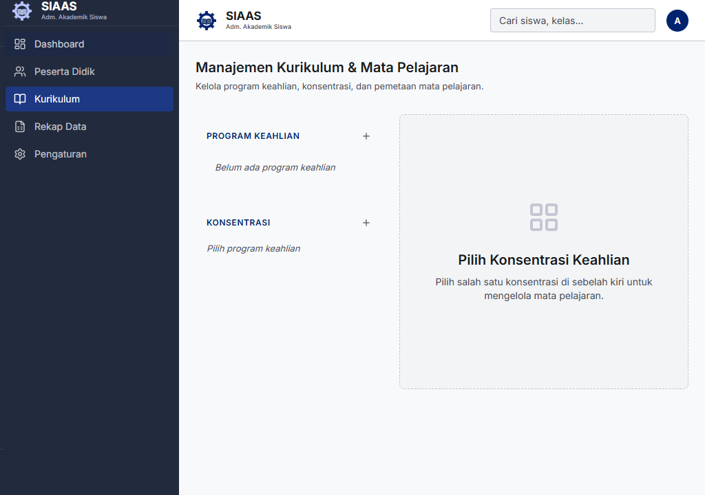

---

## 2. Mengelola Program Keahlian
Program Keahlian adalah kategori induk tertinggi dalam struktur kurikulum sekolah (contoh: *Teknik Mesin*, *Teknik Informatika*).

### Menambah Program Keahlian Baru
1. Pada halaman Kurikulum, cari bagian **Program Keahlian**.
2. Klik tombol **Tambah Program** (ikon `+`).
3. Dialog pop-up "Tambah Program" akan muncul.

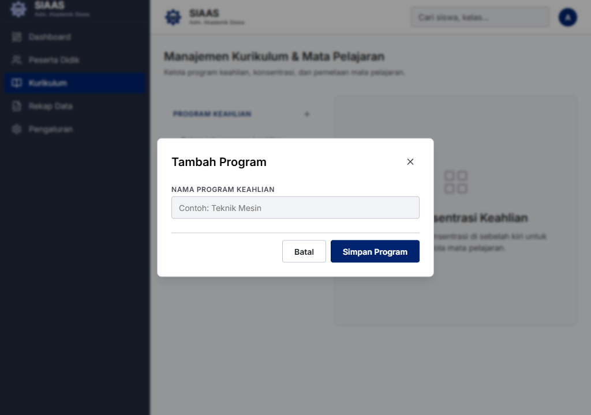

4. Masukkan nama program keahlian pada kolom input teks yang tersedia.
5. Klik tombol **Simpan Program**. Program baru akan segera muncul pada daftar di sebelah kiri.

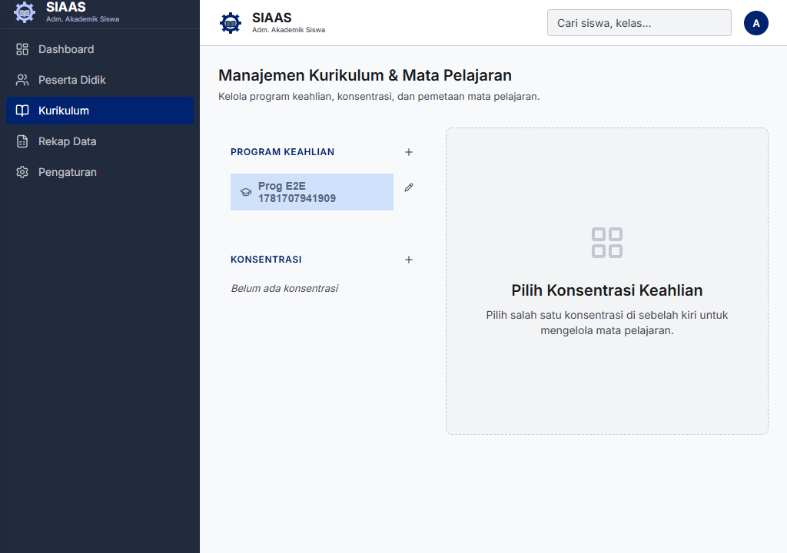

### Mengubah (Edit) Program Keahlian
1. Pada daftar Program Keahlian, arahkan kursor ke nama program yang ingin diubah.
2. Klik ikon pensil (Edit) yang muncul di samping nama program.
3. Dialog edit akan terbuka. Ubah nama program sesuai kebutuhan.

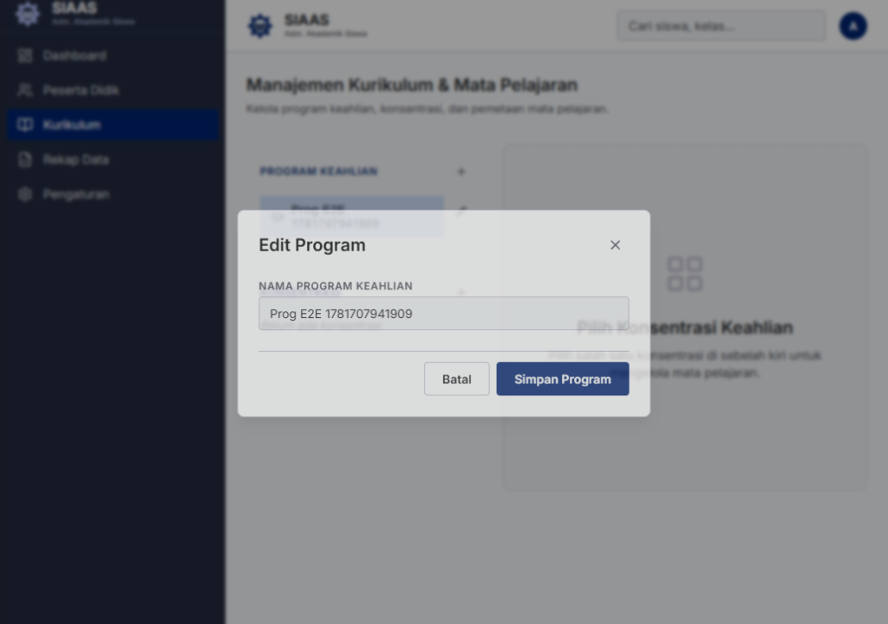

4. Klik **Simpan Program**.

---

## 3. Mengelola Konsentrasi Keahlian
Konsentrasi Keahlian adalah turunan/sub-kategori dari sebuah Program Keahlian (contoh: *Teknik Pemesinan* berada di bawah *Teknik Mesin*).

### Menambah Konsentrasi Keahlian Baru
1. Pilih (klik) salah satu **Program Keahlian** pada daftar di sebelah kiri terlebih dahulu.
2. Pada bagian tengah layar, klik tombol **Tambah Konsentrasi**.
3. Dialog pop-up "Tambah Konsentrasi" akan muncul.

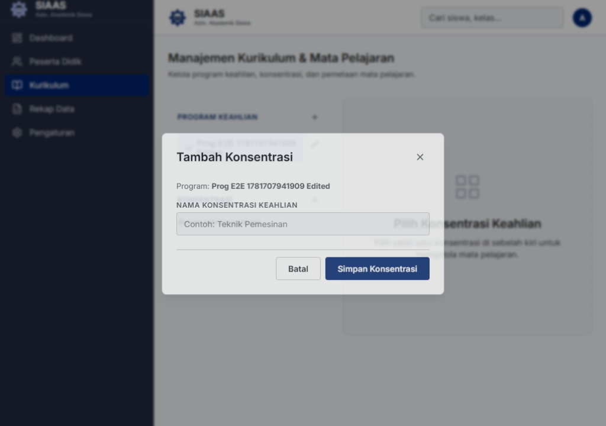

4. Masukkan nama konsentrasi keahlian yang baru.
5. Klik **Simpan Konsentrasi**.

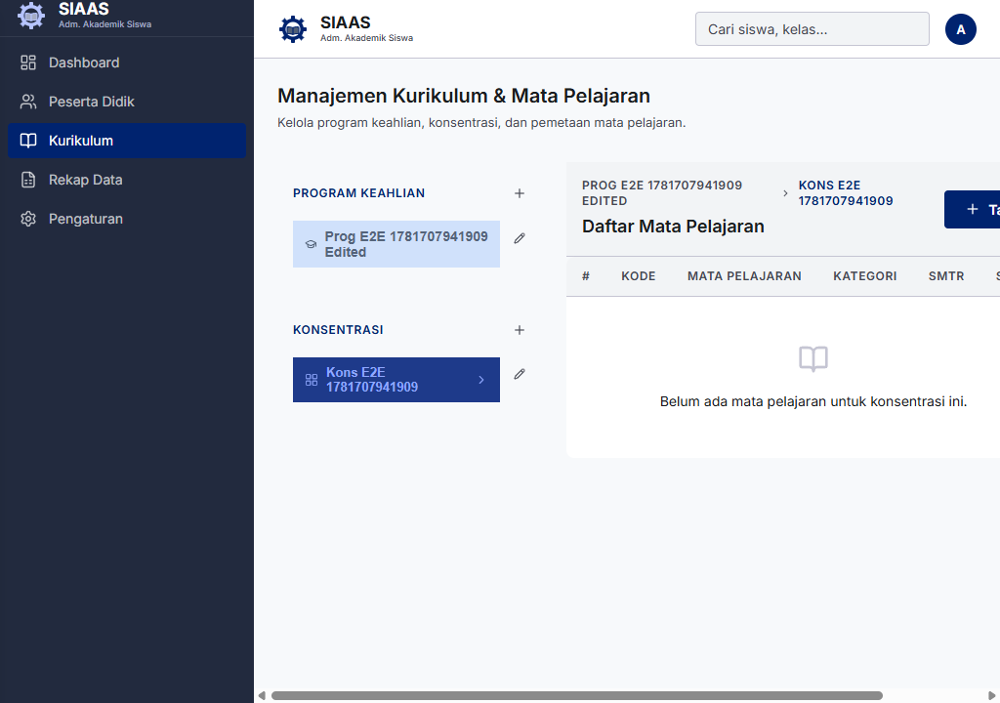

### Mengubah (Edit) Konsentrasi Keahlian
1. Pastikan Anda telah mengklik Program Keahlian yang benar.
2. Pada daftar Konsentrasi, temukan nama konsentrasi yang ingin diedit.
3. Klik ikon pensil (Edit) di samping konsentrasi tersebut.
4. Lakukan perubahan teks.

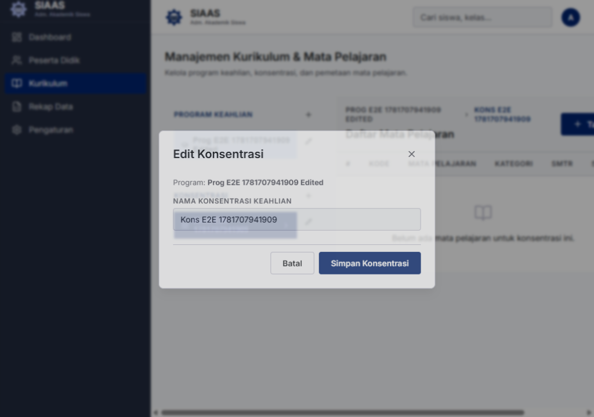

5. Klik **Simpan Konsentrasi**.

---

## 4. Mengelola Mata Pelajaran
Mata Pelajaran (Mapel) diatur spesifik berdasarkan Konsentrasi Keahlian.

### Menambah Mata Pelajaran Baru
1. Pilih **Program Keahlian** yang sesuai.
2. Pilih **Konsentrasi Keahlian** yang sesuai. Setelah konsentrasi dipilih, tabel Daftar Mata Pelajaran akan muncul di sebelah kanan.
3. Klik tombol **Tambah Mapel**.
4. Pada form pop-up, lengkapi informasi berikut:
   - **No Urut:** Nomor urut mapel.
   - **Kode Mapel:** Masukkan kode unik mata pelajaran.
   - **Nama Mapel:** Masukkan nama lengkap mata pelajaran.
   - **Semester:** Centang kotak semester yang relevan di mana mata pelajaran ini diajarkan.

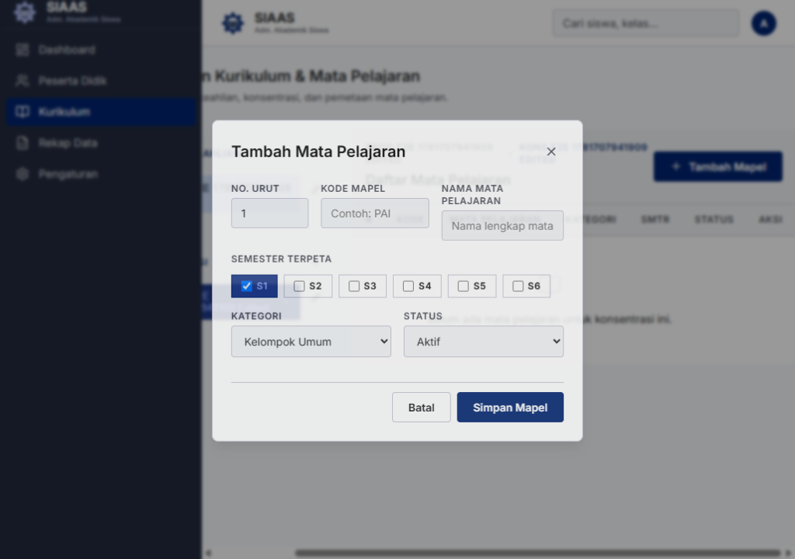

5. Klik **Simpan Mapel**. Data akan langsung ditambahkan ke dalam tabel.

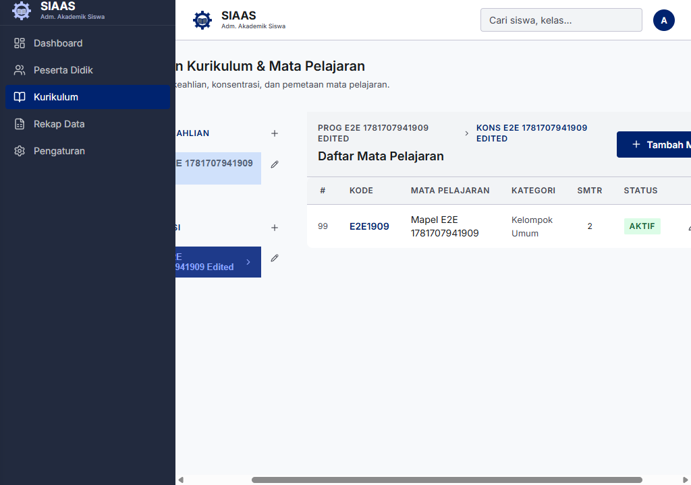

### Mengubah (Edit) Mata Pelajaran
1. Cari mata pelajaran yang ingin diubah pada tabel.
2. Pada kolom "Aksi" di baris tersebut, klik tombol berikon pensil (Edit).
3. Perbarui informasi yang diperlukan pada formulir pop-up.

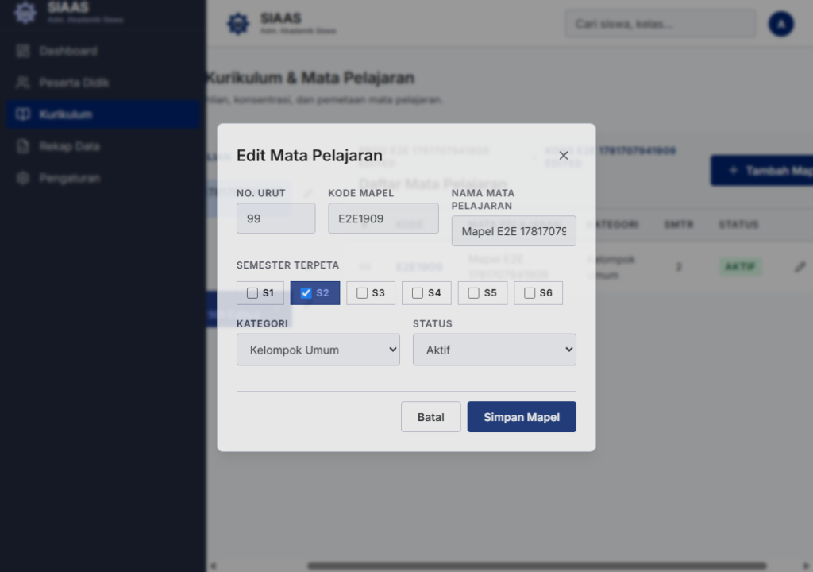

4. Klik **Simpan Mapel**. Perubahan akan langsung terlihat pada tabel.

### Menghapus Mata Pelajaran
1. Cari mata pelajaran yang ingin dihapus pada tabel.
2. Pada kolom "Aksi", klik tombol berikon tempat sampah (Hapus).
3. Dialog konfirmasi akan muncul menampilkan nama mata pelajaran yang akan dihapus.

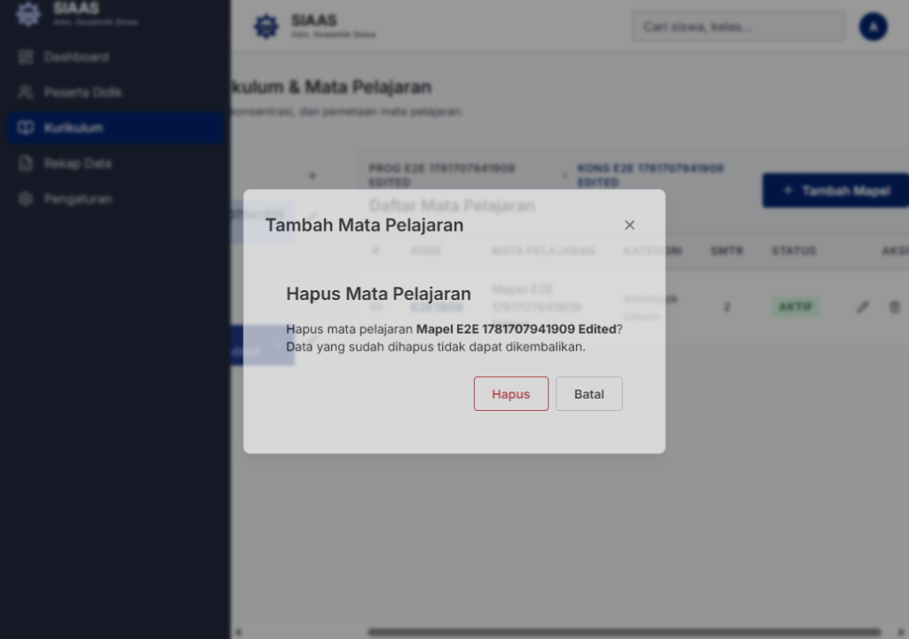

4. Klik **Hapus** untuk mengonfirmasi, atau klik **Batal** untuk membatalkan.
5. Baris mata pelajaran akan dihapus dari daftar secara permanen.
