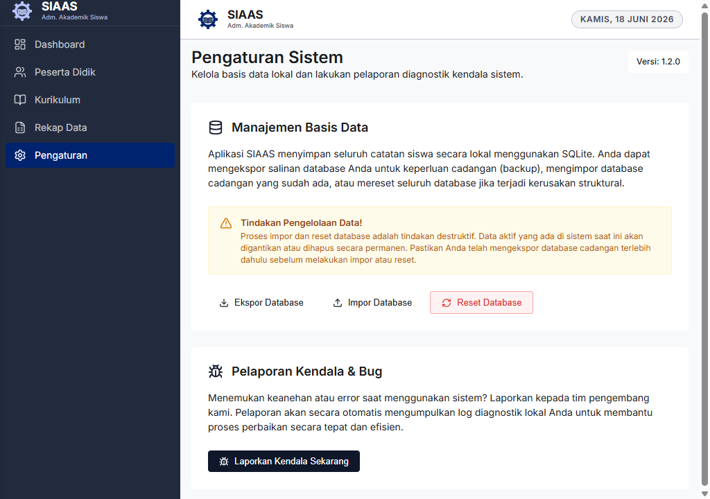
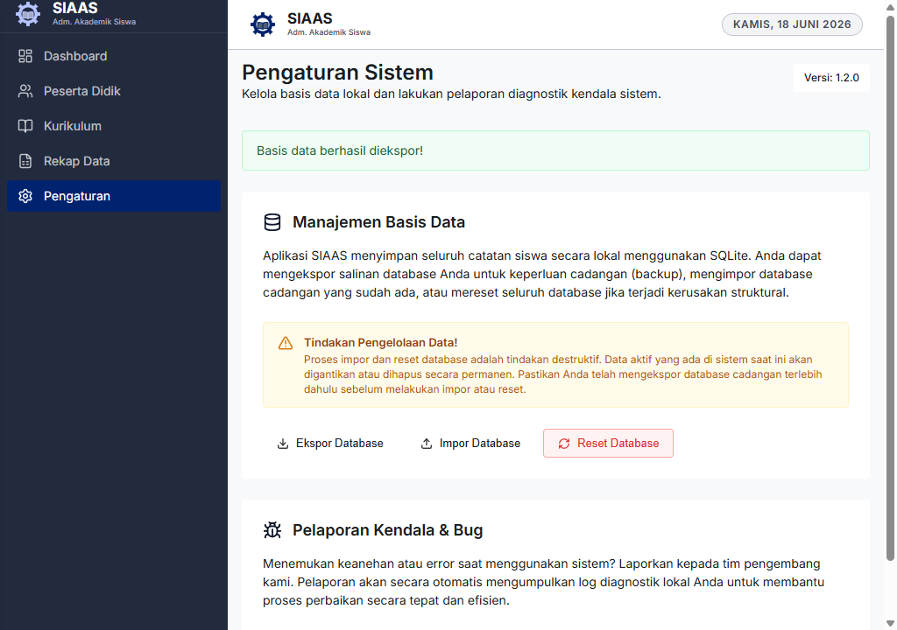
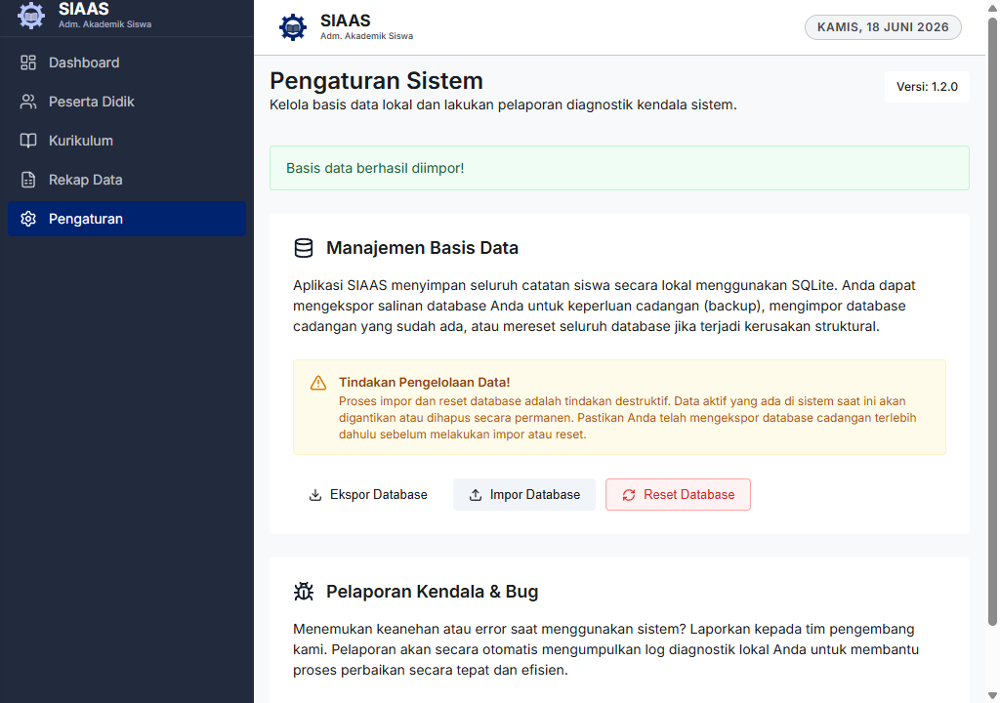
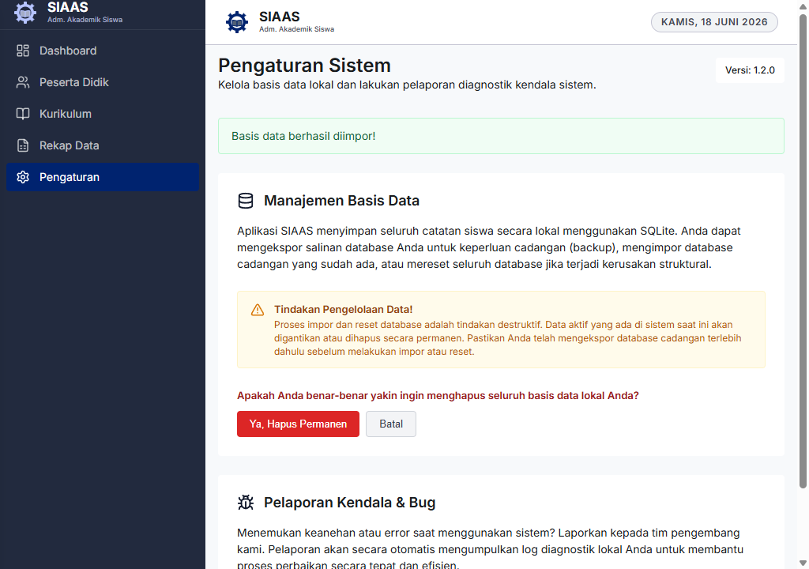
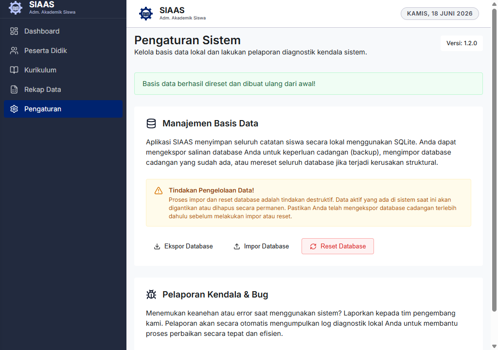
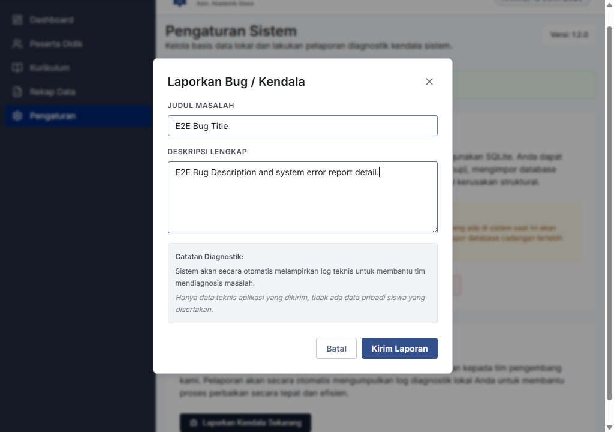
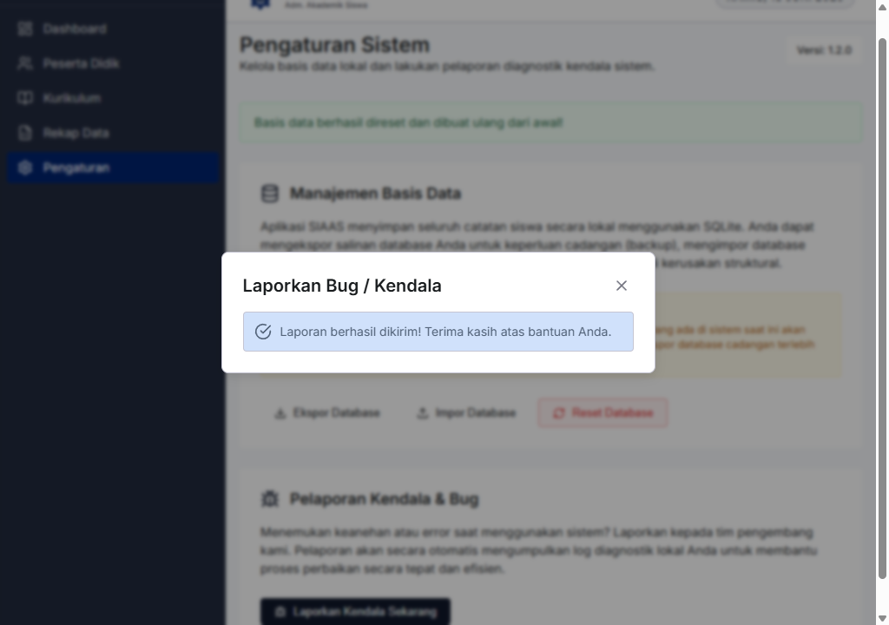

# Panduan Pengguna: Pengaturan Sistem

Halaman **Pengaturan Sistem** adalah pusat kendali administratif SIAS. Di sini Anda dapat mengelola keamanan data melalui fitur cadangan (*backup*) basis data, serta melaporkan kendala teknis kepada tim pengembang.

Panduan ini disusun berdasarkan skenario penggunaan nyata aplikasi SIAS dan dilengkapi dengan tangkapan layar langsung dari aplikasi.

## 1. Mengakses Halaman Pengaturan

1. Buka aplikasi SIAS.
2. Pada menu navigasi utama (sidebar) di sebelah kiri, klik menu **Pengaturan**.
3. Anda akan diarahkan ke halaman **Pengaturan Sistem**, yang terdiri dari dua bagian utama:
   - **Manajemen Basis Data** — untuk keperluan backup, restore, dan reset.
   - **Pelaporan Kendala & Bug** — untuk melaporkan masalah teknis kepada pengembang.

> **Catatan:** Nomor versi aplikasi yang sedang aktif ditampilkan di pojok kanan atas halaman ini.

---

## 2. Manajemen Basis Data

SIAS menyimpan seluruh catatan siswa secara lokal menggunakan basis data SQLite. Bagian ini menyediakan tiga operasi pengelolaan data utama.

> ⚠️ **Perhatian — Tindakan Destruktif:** Proses **Impor** dan **Reset** database akan menggantikan atau menghapus data aktif secara permanen. Selalu **Ekspor** basis data Anda terlebih dahulu sebagai cadangan sebelum menjalankan kedua operasi tersebut.

---

### 2.1. Ekspor Database (Backup)

Ekspor berfungsi untuk membuat salinan cadangan (*backup*) seluruh data SIAS ke sebuah berkas `.db` di komputer Anda. Lakukan ini secara rutin untuk mencegah kehilangan data.

**Langkah-langkah:**

1. Pada bagian **Manajemen Basis Data**, klik tombol **Ekspor Database**.
2. Jendela simpan berkas (*file dialog*) akan terbuka. Pilih lokasi penyimpanan dan nama berkas yang diinginkan.
3. Klik **Simpan**.
4. Pesan konfirmasi hijau **"Basis data berhasil diekspor!"** akan muncul di bagian atas halaman.

---

### 2.2. Impor Database (Restore)

Impor berfungsi untuk mengembalikan (*restore*) data SIAS dari berkas cadangan `.db` yang sebelumnya pernah diekspor. Operasi ini akan **menimpa seluruh data aktif** yang ada saat ini.

**Langkah-langkah:**

1. Klik tombol **Impor Database**.
2. Dialog konfirmasi akan muncul dengan pesan: *"Apakah Anda yakin ingin mengimpor database baru? Tindakan ini akan menimpa database aktif Anda saat ini secara permanen."*
3. Klik **OK** untuk melanjutkan, atau **Batal** untuk membatalkan.
4. Jendela pilih berkas (*file dialog*) akan terbuka. Navigasikan ke lokasi berkas `.db` cadangan Anda, lalu klik **Buka**.
5. Tunggu proses impor selesai. Pesan konfirmasi hijau **"Basis data berhasil diimpor!"** akan muncul.

---

### 2.3. Reset Database

Reset berfungsi untuk menghapus **seluruh** data di sistem dan membuat basis data baru yang kosong dari awal. Gunakan fitur ini hanya jika terjadi kerusakan struktural pada basis data yang tidak dapat diperbaiki.

> 🔴 **Peringatan Keras:** Tindakan ini **tidak dapat dibatalkan**. Semua data siswa, nilai, dan kurikulum yang tersimpan akan hilang permanen. **Ekspor basis data Anda terlebih dahulu** sebelum melanjutkan.

**Langkah-langkah:**

1. Klik tombol **Reset Database** (berlatar merah).
2. Panel konfirmasi inline akan muncul di halaman, menanyakan: *"Apakah Anda benar-benar yakin ingin menghapus seluruh basis data lokal Anda?"*

   

3. Terdapat dua pilihan:
   - Klik **Batal** untuk membatalkan dan kembali ke tampilan normal tanpa ada perubahan apa pun.
   - Klik **Ya, Hapus Permanen** untuk melanjutkan proses reset.

4. Jika dikonfirmasi, tunggu proses selesai. Pesan **"Basis data berhasil direset dan dibuat ulang dari awal!"** akan ditampilkan.

   

---

## 3. Pelaporan Kendala & Bug

Jika Anda menemukan perilaku yang tidak sesuai, error, atau kendala teknis saat menggunakan SIAS, gunakan fitur ini untuk melaporkannya langsung kepada tim pengembang. Sistem akan secara otomatis menyertakan log diagnostik lokal untuk membantu proses perbaikan.

**Langkah-langkah:**

1. Pada bagian **Pelaporan Kendala & Bug**, klik tombol **Laporkan Kendala Sekarang**.
2. Modal **"Laporkan Bug / Kendala"** akan terbuka.
3. Isi formulir laporan:
   - **Judul Kendala:** Deskripsikan masalah secara singkat dan jelas (contoh: *"Tombol Simpan tidak merespons pada form tambah siswa"*).
   - **Detail & Langkah Reproduksi:** Jelaskan langkah-langkah yang menyebabkan masalah terjadi, beserta pesan error yang muncul (jika ada).

   

4. Setelah formulir terisi, klik tombol **Kirim Laporan**.
5. Pesan sukses akan muncul di dalam modal, mengonfirmasi bahwa laporan Anda berhasil dikirim. Modal akan otomatis menutup setelah beberapa saat.

   
