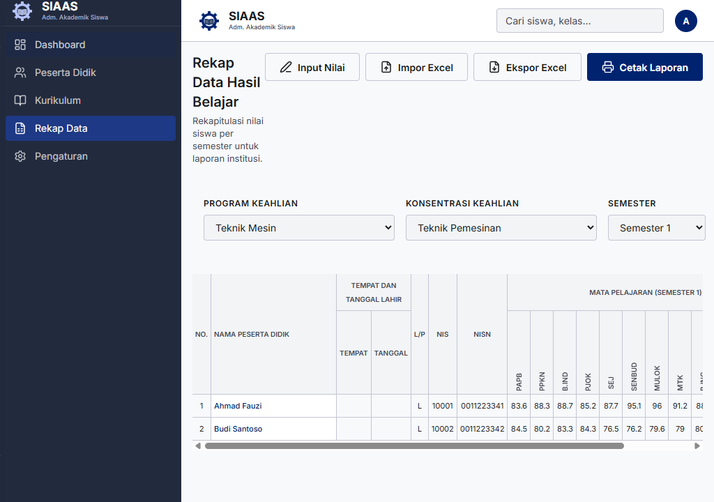
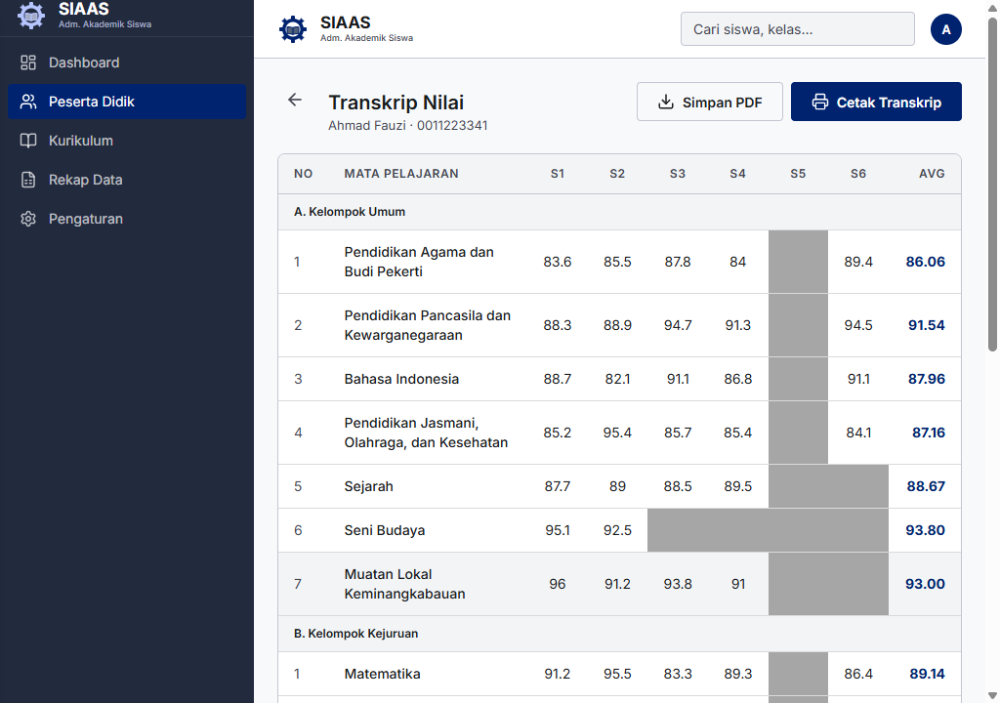

# Panduan Pengguna: Rekap Data Hasil Belajar

Modul Rekap Data Hasil Belajar menyediakan tampilan rekapitulasi nilai seluruh siswa dalam format spreadsheet. Anda dapat memasukkan nilai secara manual, mengimpor/mengekspor data melalui Excel, mencetak laporan resmi, serta mengakses transkrip individu siswa.

Panduan ini disusun berdasarkan skenario penggunaan nyata aplikasi SIAS dan dilengkapi dengan tangkapan layar langsung dari aplikasi.

## 1. Mengakses Halaman Rekap Data
1. Buka aplikasi SIAS.
2. Pada menu navigasi utama (sidebar) di sebelah kiri, klik menu **Rekap Data**.
3. Anda akan diarahkan ke halaman **Rekap Data Hasil Belajar**.

---

## 2. Menggunakan Filter Data
Sebelum melihat atau mengedit nilai, Anda perlu memilih filter untuk menentukan data yang ditampilkan.

### Program Keahlian
1. Pada bagian **Program Keahlian**, pilih program yang sesuai (contoh: *Teknik Mesin*).
2. Setelah memilih program, kolom **Konsentrasi Keahlian** akan otomatis terisi dengan pilihan konsentrasi yang tersedia di bawah program tersebut.

### Konsentrasi Keahlian
1. Pilih **Konsentrasi Keahlian** dari dropdown (contoh: *Teknik Pemesinan*).
2. Tabel rekap akan menampilkan seluruh siswa yang terdaftar pada konsentrasi tersebut.

### Semester
1. Gunakan dropdown **Semester** untuk memilih semester yang ingin ditampilkan (contoh: *Semester 1*, *Semester 2*).
2. Tabel akan menampilkan kolom mata pelajaran yang relevan untuk semester terpilih.

---

## 3. Memasukkan Nilai Secara Manual (Input Nilai)
Fitur ini memungkinkan Anda mengisi nilai siswa langsung pada tabel spreadsheet.

1. Pastikan filter **Program Keahlian**, **Konsentrasi Keahlian**, dan **Semester** telah dipilih dengan benar.
2. Klik tombol **Input Nilai** pada bagian kanan atas halaman.
3. Seluruh sel nilai pada tabel akan berubah menjadi kolom input angka yang dapat diedit.
4. Masukkan nilai untuk setiap siswa pada mata pelajaran yang sesuai (rentang nilai: 0–100).
5. Setelah selesai, klik tombol **Simpan Nilai**.
6. Notifikasi **"Nilai berhasil disimpan."** akan muncul sebagai konfirmasi.

> **Tips:** Klik tombol **Batal** jika Anda ingin keluar dari mode pengeditan tanpa menyimpan perubahan.

---

## 4. Mengimpor Nilai dari Excel (Impor Excel)
Anda dapat memasukkan data nilai secara massal menggunakan file Excel.

1. Siapkan file Excel (`.xlsx`) yang berisi data nilai siswa sesuai format yang ditentukan.
2. Klik tombol **Impor Excel** pada bagian kanan atas halaman.
3. Dialog pemilihan berkas akan muncul. Pilih file Excel yang telah disiapkan.
4. Sistem akan memproses file dan menampilkan dialog konfirmasi **"Impor Excel"** yang berisi ringkasan hasil impor.
5. Klik **OK** untuk menutup dialog. Tabel akan diperbarui secara otomatis dengan data nilai yang baru diimpor.

---

## 5. Mengekspor Nilai ke Excel (Ekspor Excel)
Fitur ini memungkinkan Anda mengunduh data rekap nilai dalam format Excel untuk keperluan arsip atau pelaporan eksternal.

1. Pastikan filter **Konsentrasi Keahlian** telah dipilih, karena ekspor dilakukan per konsentrasi.
2. Klik tombol **Ekspor Excel**.
3. Dialog penyimpanan berkas akan muncul. Tentukan nama dan lokasi penyimpanan file.
4. Sistem akan menyimpan file Excel dengan nama bawaan `rekap_nilai_[Konsentrasi].xlsx`.
5. Dialog konfirmasi akan muncul setelah ekspor berhasil. Klik **OK** untuk menutup.

> **Catatan:** Jika Konsentrasi Keahlian belum dipilih, sistem akan menampilkan pesan pengingat untuk memilih konsentrasi terlebih dahulu.

---

## 6. Mencetak Laporan (Cetak Laporan)
Gunakan fitur ini untuk mencetak laporan resmi Rekap Data Hasil Belajar.

1. Pastikan filter telah diatur sesuai data yang ingin dicetak.
2. Klik tombol **Cetak Laporan** pada bagian kanan atas halaman.
3. Dialog cetak sistem akan muncul. Laporan dicetak dalam orientasi *landscape* agar seluruh kolom mata pelajaran dapat tertampung.
4. Sesuaikan pengaturan printer dan klik **Print**.

Laporan cetak akan menampilkan:
- Judul **REKAP DATA HASIL BELAJAR SISWA**
- Nama sekolah: **SMKN 1 SUMATERA BARAT**
- Informasi Program Studi, Konsentrasi, Semester, dan Tahun Pelajaran
- Tabel lengkap nilai seluruh siswa

---

## 7. Melihat & Mengekspor Transkrip Nilai Siswa
Setiap nama siswa pada tabel rekap merupakan tautan yang dapat diklik untuk melihat transkrip nilai individu.

1. Pada tabel rekap, klik **nama siswa** yang ingin dilihat transkrip nilainya.
2. Anda akan diarahkan ke halaman **Transkrip Nilai** siswa tersebut.

3. Halaman transkrip memiliki **dua mode tab (tampilan)** yang dapat Anda pilih sesuai kebutuhan:
   - **Transkrip 3 Tahun**: Menampilkan matriks / grid lengkap nilai siswa per mata pelajaran dari Semester 1 hingga Semester 6, lengkap dengan rata-rata total di ujung baris/kolom.
   - **Transkrip Nilai**: Merupakan ringkasan atau nilai pendamping ijazah yang berisi satu nilai agregasi (rata-rata atau nilai akhir) untuk masing-masing kelompok mata pelajaran.
4. **Cetak & Ekspor**:
   - Klik tombol **Cetak Transkrip** untuk memunculkan antarmuka cetak *browser* / *system print dialog*.
   - Klik tombol **Simpan PDF** untuk mengunduh dokumen tersebut dalam bentuk berkas PDF secara instan. Fitur ini memproses tata letak dokumen sesuai dengan tab yang sedang aktif.
5. Untuk kembali ke halaman Rekap, gunakan tombol navigasi kembali pada browser atau klik menu **Rekap Data** di sidebar.

---

## 8. Spesifikasi Teknis (Technical Specs)
Bagian ini ditujukan bagi administrator atau pengembang sistem untuk memahami alur kerja beberapa fitur spesifik terkait pengelolaan transkrip.

### Agregasi Transkrip & `transcriptGroup`
Pengelompokan nilai pada tab **Transkrip Nilai** tidak hanya berdasarkan `kategori` (Umum vs Kejuruan), tetapi menggunakan metadata agregasi spesifik bernama `transcriptGroup`. Aturan dasarnya:
- `UMUM`: Mata pelajaran kelompok umum konvensional. Rata-rata dihitung dari seluruh nilai semester yang ada.
- `KEJURUAN_UMUM`: Mata pelajaran kelompok kejuruan non-konsentrasi.
- `KEJURUAN_DASAR`: Mata pelajaran dasar kejuruan (biasanya Dasar Program Keahlian / DDK). Perhitungan nilai pendamping untuk grup ini dibatasi / diagregasi secara spesifik berdasarkan semester relevan (misal S1-S2).
- `KEJURUAN_KONSENTRASI`: Mata pelajaran spesifik peminatan / konsentrasi keahlian. Nilai ini biasanya digabungkan dan dibobotkan bersama nilai UKK.
- `UKK`: Uji Kompetensi Keahlian, mata pelajaran yang tidak dicetak pada transkrip 3 tahun standar namun digunakan dalam perhitungan nilai konsentrasi.

### Arsitektur Render & Ekspor PDF
Fitur "Simpan PDF" untuk transkrip menggunakan arsitektur **Client-Side Rendering (Frontend)** dengan integrasi `html2canvas-pro` dan `jspdf`:
1. **DOM Capture**: Saat tombol ekspor ditekan, aplikasi me-render tata-letak *print-only* yang tersembunyi (`display: none` -> dialihkan sementara *off-screen*).
2. **Canvas Rasterization**: Pustaka `html2canvas` menggambar elemen-elemen DOM tersebut (termasuk font *Times New Roman*, layout grid, border tabel) ke dalam objek Canvas bersolusi tinggi (scale 2).
3. **PDF Generation**: Pustaka `jsPDF` memotong (slice) canvas menjadi beberapa halaman A4 potret jika tingginya melebihi standar panjang halaman tunggal, lalu menghasilkan blob `.pdf` untuk diunduh.
4. **Keamanan & Performa**: Eksekusi 100% dilakukan di dalam WebView Tauri. Tidak ada pengiriman data PII (Personal Identifiable Information) milik siswa ke server backend selama proses pembuatan PDF, dan format hasil (*WYSIWYG*) selalu identik dengan CSS `@media print` aplikasi.