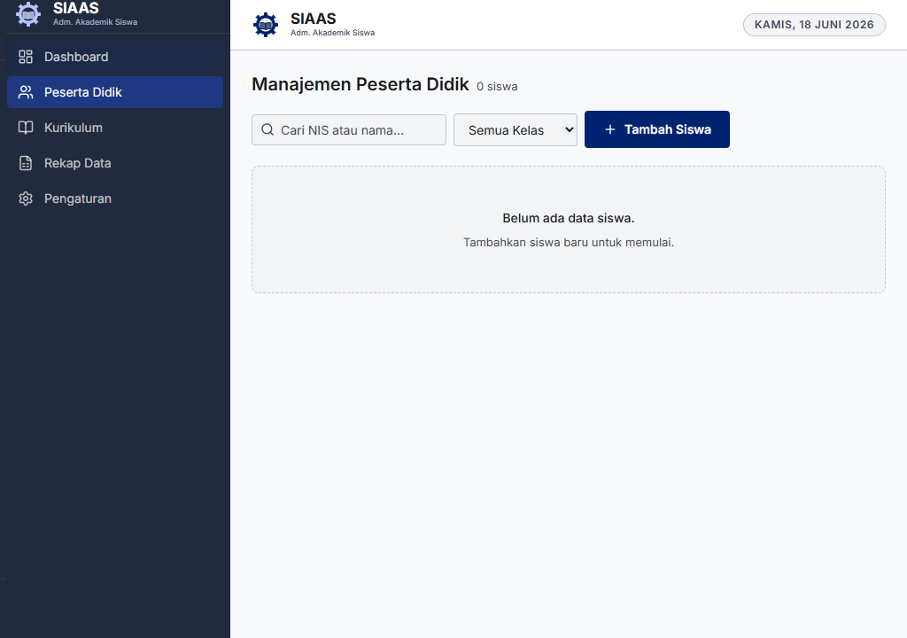
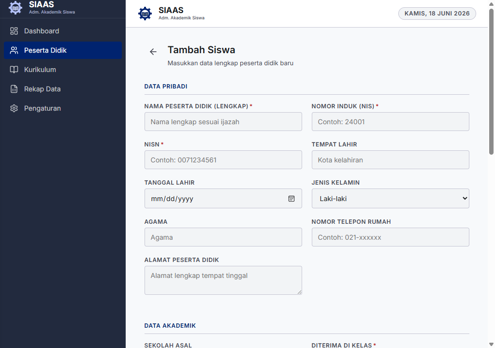
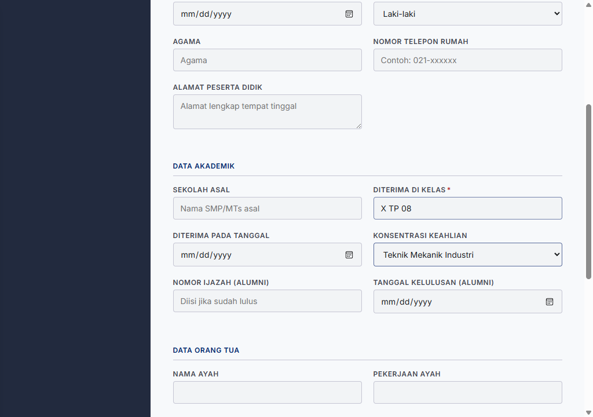
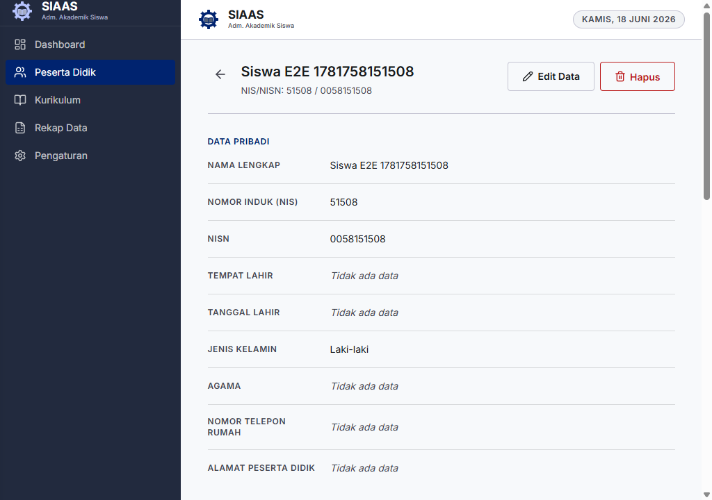
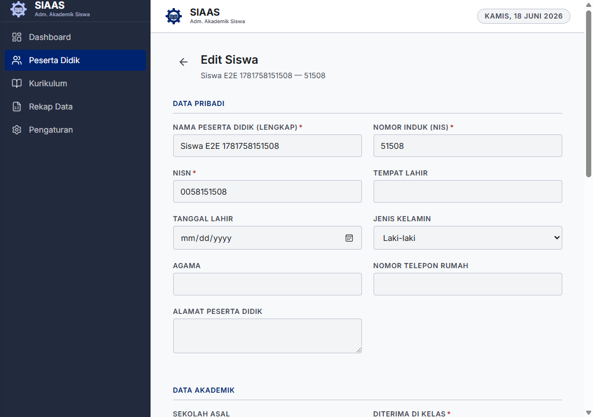
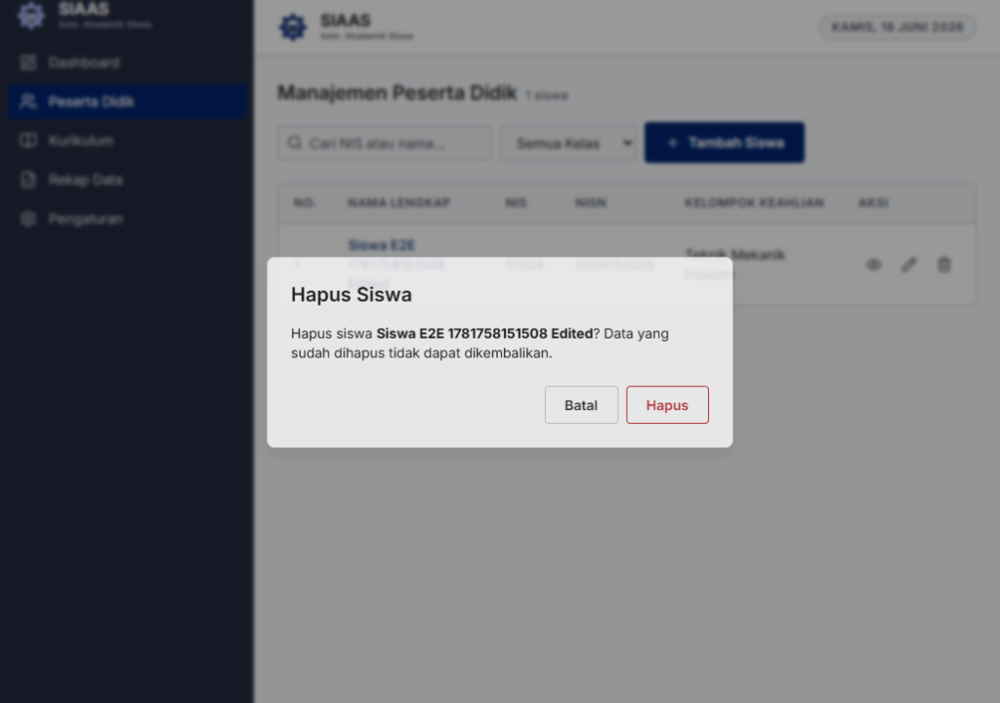

# Panduan Pengguna: Manajemen Peserta Didik (Siswa)

Modul Peserta Didik digunakan untuk mengelola data inti seluruh siswa, termasuk menambahkan siswa baru, melihat daftar, mengedit profil, dan menghapus data siswa.

Panduan ini disusun berdasarkan skenario penggunaan nyata aplikasi SIAS dan dilengkapi dengan tangkapan layar langsung dari aplikasi.

## 1. Mengakses Daftar Peserta Didik
1. Buka aplikasi SIAS.
2. Pada menu navigasi utama di sebelah kiri, klik menu **Peserta Didik**.
3. Anda akan melihat halaman **Manajemen Peserta Didik** yang menampilkan tabel daftar seluruh siswa yang terdaftar di sekolah.

---

## 2. Menambah Siswa Baru
Untuk menambahkan data siswa baru ke dalam sistem:

1. Pada halaman Manajemen Peserta Didik, klik tombol **Tambah Siswa** yang berada di sudut kanan atas.
2. Anda akan diarahkan ke halaman **Tambah Siswa**.

3. Lengkapi formulir pendaftaran. Beberapa kolom penting antara lain:
   - **Nama Peserta:** Nama lengkap siswa.
   - **Nomor Induk:** Nomor Induk Siswa (NIS) lokal sekolah.
   - **NISN:** Nomor Induk Siswa Nasional.
   - **Diterima di Kelas:** Kelas awal saat siswa masuk (contoh: X TP 1).
   - **Konsentrasi Keahlian:** Pilih jurusan/konsentrasi dari opsi yang tersedia.

4. Klik tombol **Simpan Siswa** di bagian bawah form.
5. Anda akan dikembalikan ke daftar siswa, dan siswa baru tersebut akan muncul di dalam tabel.

---

## 3. Melihat Detail Siswa
Anda dapat melihat informasi lengkap dari profil seorang siswa melalui fitur ini.

1. Temukan siswa yang ingin dilihat pada tabel **Manajemen Peserta Didik**.
2. Pada kolom **Aksi**, klik tombol berikon mata (**Lihat detail**).
3. Halaman profil siswa akan terbuka, menampilkan detail seperti NIS, NISN, Konsentrasi, dan informasi pribadi lainnya.

4. Untuk kembali ke daftar, klik tombol **Kembali ke Daftar Siswa**.

---

## 4. Mengubah (Edit) Data Siswa
Jika terjadi kesalahan input atau ada pembaruan data (seperti pindah kelas), Anda dapat memperbaruinya.

1. Temukan siswa yang ingin diedit pada tabel **Manajemen Peserta Didik**.
2. Pada kolom **Aksi**, klik tombol berikon pensil (**Edit**).
3. Halaman formulir edit akan terbuka.

4. Lakukan perubahan pada kolom yang diperlukan (misalnya: memperbaiki nama).
5. Klik tombol **Simpan Perubahan**.
6. Anda akan diarahkan ke halaman Detail Siswa untuk memverifikasi bahwa perubahan telah berhasil disimpan.

---

## 5. Menghapus Data Siswa
*(Perhatian: Tindakan ini bersifat permanen dan tidak dapat dibatalkan.)*

1. Temukan siswa yang ingin dihapus pada tabel **Manajemen Peserta Didik**.
2. Pada kolom **Aksi**, klik tombol berikon tempat sampah (**Hapus**).
3. Akan muncul dialog pop-up konfirmasi yang menampilkan nama siswa tersebut untuk mencegah penghapusan tidak disengaja.

4. Jika Anda yakin, klik tombol **Hapus**.
5. Data siswa akan dihapus dari sistem dan baris tersebut akan hilang dari tabel.
